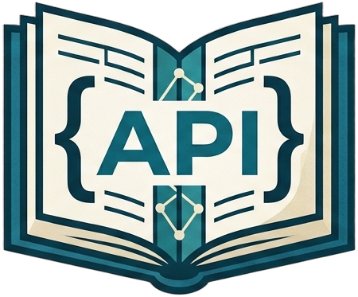

# ledgapi

<div align="center">
  
</div>

> **API contracts, remembered by your agents.**

A self-hosted, agent-native **API contract registry**. AI coding agents (Claude Code, Cursor, etc.) connect over MCP to query what endpoints already exist before writing code, and to register new endpoints after creating them. A login-protected web UI lets humans review contracts and audit history.

---

## What is ledgapi

ledgapi is a single-binary, single-container registry for the **API contracts** of your project — methods, paths, request/response schemas, status, owner — not a request runner. It is the source of truth that answers "what endpoints does this codebase already expose?" without reading every route file by hand.

The primary consumers are AI coding agents. They hit ledgapi over the [Model Context Protocol](https://modelcontextprotocol.io/) through OAuth 2.1, search for existing contracts before generating a new route, and write back a contract when they create one. Humans browse the same data through a read-only web UI, manage users, and export OpenAPI for downstream tooling.

## Why use it

The problem: AI agents working on a codebase routinely **rebuild endpoints that already exist** because they have no machine-readable view of the routes the project has. Postman stores calls, not contracts. Wiki pages drift. Swagger annotations help but only if every developer remembers to keep them current.

ledgapi fixes this with three properties:

- **RAG duplicate check on every `create_contract`.** Before a contract is written, the system runs a semantic similarity search against the same project. If a near-duplicate exists, the agent is warned and the insert is rejected unless `force=true`. Duplicates are prevented without coordination between agents.
- **MCP-native, not HTTP-only.** Eleven purpose-built tools for the common operations agents need: search, list, get, create, update, delete, plus project/group management and OpenAPI export. OAuth 2.1 with PKCE, so the agent stores its own tokens; your `.mcp.json` only carries `type` and `url`.
- **Self-hosted, offline-capable, single container.** SQLite (WAL) for relational data, `sqlite-vec` for vector search, `fastembed-rs` for local embedding generation. No third-party API keys, no cloud dependency, no telemetry. The Docker image runs on a Raspberry Pi or in a corporate air-gapped network with equal ease.

Other things that come along: per-contract audit history with the acting user, three-role permission model (viewer / editor / super-admin), OpenAPI 3.x export per project, and zero `unsafe` in the codebase.

## Key features

- **11 MCP tools** covering full CRUD, hybrid search (semantic + exact), projects, groups, and OpenAPI export.
- **Duplicate detection** via local sentence embeddings; threshold is configurable.
- **OAuth 2.1 + PKCE** for MCP clients; no static API tokens to paste in config files.
- **Three roles**: viewer (read), editor (CRUD via MCP), super-admin (user management + global audit log).
- **Append-only audit log** of every create / update / delete with its actor. Reads are not audited.
- **OpenAPI 3.x export** per project as a downloadable `openapi.yml`.
- **Single static binary** in a slim Debian image; ~120 MB on disk, ~50 MB RSS after warm-up.
- **No `unsafe`, no third-party API calls, no telemetry.**

## Architecture

```text
┌─────────────────────────────────────────────────────────┐
│                Docker container (ledgapi)                │
│                                                          │
│  ┌──────────────────┐    ┌───────────────────────────┐  │
│  │  MCP server       │    │   Web UI (server-rendered) │  │
│  │  HTTP, /mcp       │    │   Askama templates         │  │
│  └─────────┬─────────┘    └────────────┬──────────────┘  │
│            │                           │                  │
│            └──────────┬────────────────┘                  │
│                       │                                   │
│              ┌────────▼─────────┐                         │
│              │   Core service   │                         │
│              │  (business rules)│                         │
│              └────────┬─────────┘                         │
│                       │                                   │
│         ┌─────────────┼─────────────┐                     │
│         │             │             │                     │
│   ┌─────▼─────┐  ┌────▼─────┐  ┌────▼──────────┐         │
│   │  SQLite    │  │ sqlite-  │  │  fastembed-rs │         │
│   │ (relational)│ │ vec      │  │  (local embeds)│        │
│   └───────────┘  └──────────┘  └───────────────┘         │
│                                                          │
└──────────────────────────────────────────────────────────┘
         ▲
         │  OAuth 2.1 (browser login + PKCE, refresh tokens)
         │
   ┌─────┴──────┐
   │ AI agent   │  .mcp.json: { "type": "http", "url": "..." }
   │ (any MCP)  │
   └────────────┘
```

Single binary (`ledgapi`), single volume (`/data`) for the SQLite database and the embedding model cache. The web UI and the MCP server share the same HTTP listener on `:18080`; the only difference is the auth layer (session cookie for the UI, bearer access token for `/mcp`).

## Quickstart

You need a working Docker engine and an MCP-capable client (Claude Code, Cursor, etc.).

### 1. Start the server

```bash
export INITIAL_USERNAME=admin
export INITIAL_PASSWORD='change-this-password'   # minimum 12 characters
docker compose -f docker/docker-compose.yaml up -d
```

On the very first boot the database is empty, so these two variables seed the **initial super-admin**. On every subsequent start they are ignored — existing users are never overwritten.

The container exposes `:18080`. Open <http://localhost:18080/> and sign in with the credentials above. The web UI is now usable. Create more users (viewer / editor / super-admin) under `/admin/users`.

### 2. Connect an MCP client

`.mcp.json` carries only the transport — no tokens, no API keys:

```json
{
  "mcpServers": {
    "ledgapi": {
      "type": "http",
      "url": "http://localhost:18080/mcp"
    }
  }
}
```

On first connect, an OAuth-capable client discovers ledgapi's authorization metadata, opens your browser, asks you to log in, and shows a consent screen. The resulting access and refresh tokens are stored by the client itself. Nothing is pasted into config files.

### 3. Register your first contract

From your agent's chat:

> _"List my projects, then create a contract `POST /api/v1/users` in the `acme-api` project under the `Auth` group, with a bearer-auth header, an email/password body, and a 201 response that returns `{ id, email, created_at }`."_

The agent calls `list_projects` → `create_contract`. If a similar endpoint already exists, ledgapi returns a warning with the candidates and refuses to insert. The agent either picks one of the existing contracts (`get_contract_by_id`) or re-issues with `force=true`.

## MCP tools

All tools except `list_projects` require a `project_slug`. Scopes are derived from the caller's role.

| Tool | Purpose |
| --- | --- |
| [`list_projects`](#list_projects) | List every project with its contract count. |
| [`create_project`](#create_project) | Create a new project. |
| [`list_groups`](#list_groups) | List groups (Auth, Users, Billing, …) within a project. |
| [`create_group`](#create_group) | Create a group. Supports nested groups. |
| [`list_contracts`](#list_contracts) | List contract summaries, filterable by group and status. |
| [`get_contract_by_id`](#get_contract_by_id) | Fetch the full contract (schemas, examples, auth). |
| [`create_contract`](#create_contract) | Create a contract; **runs RAG dedup first**. |
| [`update_contract`](#update_contract) | Update one or more fields of a contract. |
| [`delete_contract`](#delete_contract) | Delete a contract. |
| [`search_contract`](#search_contract) | Hybrid semantic + exact search. |
| [`export_openapi`](#export_openapi) | Export the project as OpenAPI 3.x YAML. |

---

### `list_projects`

```json
// input
{}

// output
{ "projects": [ { "slug": "acme-api", "name": "Acme API", "contract_count": 42 } ] }
```

### `create_project`

```json
// input
{ "slug": "acme-api", "name": "Acme API", "description": "Public + admin API" }

// output
{ "status": "created", "project_slug": "acme-api" }
```

### `list_groups`

```json
// input
{ "project_slug": "acme-api" }

// output
{ "groups": [ { "id": "…", "name": "Auth", "contract_count": 12 } ] }
```

### `create_group`

```json
// input
{ "project_slug": "acme-api", "name": "Billing", "parent_group_name": "Internal" }

// output
{ "status": "created", "group_id": "…" }
```

### `list_contracts`

```json
// input
{ "project_slug": "acme-api", "group_name": "Auth", "status": "stable" }

// output
{ "contracts": [ { "id": "…", "method": "POST", "path": "/api/v1/login", "summary": "…" } ] }
```

### `get_contract_by_id`

```json
// input
{ "project_slug": "acme-api", "contract_id": "…" }

// output
{ "id": "…", "method": "POST", "path": "/api/v1/login", "summary": "…", "request_body_schema": {…}, "response_schema": {…}, … }
```

### `create_contract`

Runs a **RAG similarity check** before insert. If a contract in the same project scores above the configured similarity threshold (default `0.85`, env `APP__EMBED__SIMILARITY_THRESHOLD`), the insert is rejected and similar candidates are returned. Re-issue with `force=true` to override.

```json
// input
{
  "project_slug": "acme-api",
  "group_name": "Auth",
  "method": "POST",
  "path": "/api/v1/login",
  "summary": "Email + password login",
  "description": "Returns bearer access + refresh tokens.",
  "request_body_schema": { "type": "object", "properties": { "email": { "type": "string" }, "password": { "type": "string" } }, "required": ["email", "password"] },
  "response_schema":  { "type": "object", "properties": { "access_token": { "type": "string" }, "refresh_token": { "type": "string" } } },
  "auth_type": "none",
  "tags": ["public", "v1"],
  "force": false
}
```

```json
// output (no similar contract)
{ "status": "created", "contract_id": "…" }

// output (similar contract found, force was false)
{
  "status": "warning_similar_found",
  "similar_contracts": [
    { "id": "…", "method": "POST", "path": "/api/v1/session", "similarity": 0.91 }
  ],
  "message": "Similar contracts found. Resend with force=true if you still want to create."
}
```

### `update_contract`

```json
// input
{ "project_slug": "acme-api", "contract_id": "…", "summary": "Email + password login (revised)", "status": "stable" }

// output
{ "status": "updated", "contract_id": "…" }
```

### `delete_contract`

```json
// input
{ "project_slug": "acme-api", "contract_id": "…" }

// output
{ "status": "deleted" }
```

### `search_contract`

Hybrid search. `search_mode` accepts `semantic`, `exact`, or `hybrid` (default). `query` may be a natural-language phrase or an exact path fragment.

```json
// input
{ "project_slug": "acme-api", "query": "create new user account", "search_mode": "hybrid", "limit": 10 }

// output
{
  "results": [
    { "id": "…", "method": "POST", "path": "/api/v1/users", "summary": "Create a new user", "similarity": 0.87 }
  ]
}
```

### `export_openapi`

```json
// input
{ "project_slug": "acme-api" }

// output
{ "yaml": "openapi: 3.0.3\ninfo:\n  …", "download_url": "/projects/acme-api/openapi.yml" }
```

The same YAML is also available directly at `GET /projects/{slug}/openapi.yml` in the web UI.

## Roles and permissions

| Role | Web UI | MCP scopes | What they can do |
| --- | --- | --- | --- |
| `viewer` | read-only | `ledgapi:read` | Browse projects, search, export OpenAPI, view audit history per contract. |
| `editor` | read-only | `ledgapi:read`, `ledgapi:write` | All of viewer, plus create / update / delete contracts via MCP. |
| `super-admin` | full | `ledgapi:read`, `ledgapi:write`, `ledgapi:admin` | All of editor, plus user management (`/admin/users`) and the global audit log (`/admin/audit`). |

The initial super-admin is the only account created from environment variables; every subsequent user is created by a super-admin through the web UI. Every successful create / update / delete is appended to the audit log with its acting user; reads, logins, and failed writes are not audited.

## Web UI

All UI routes (except `/login` and OAuth discovery) require a session. Selected routes:

| Path | Purpose |
| --- | --- |
| `GET /` | Dashboard — list of projects with contract counts. |
| `GET /projects/{slug}` | Project view: groups and contracts. |
| `GET /projects/{slug}/contracts/{id}` | Contract detail with per-contract audit history. |
| `GET /projects/{slug}/search?q=…` | Search UI (uses `search_contract` under the hood). |
| `GET /projects/{slug}/openapi.yml` | OpenAPI 3.x export download. |
| `GET /admin/users` | User management (super-admin only). |
| `GET /admin/audit` | Global audit log (super-admin only). |
| `GET /healthz`, `GET /readyz` | Liveness / readiness probes. |

The UI is fully server-rendered, no client JavaScript framework. Theming is `prefers-color-scheme` aware; the design system is documented in `DESIGN.md` (internal).

## Configuration

All knobs follow the pattern `APP__SECTION__KEY` and are loaded from environment variables or a `.env` file. The full list with defaults lives in [`.env.example`](./.env.example). The ones you will touch most often:

| Variable | Default | When to change |
| --- | --- | --- |
| `APP__SERVER__BIND` | `0.0.0.0:18080` | Reverse-proxy deployments, non-default port. |
| `APP__DATABASE__PATH` | `/data/ledgapi.db` | Point at a persistent volume in production. |
| `APP__AUTH__ISSUER` | `http://localhost:18080` | Set to your public URL in production (`https://...`). |
| `APP__AUTH__COOKIE_SECURE` | `false` | Set to `true` when serving over HTTPS. |
| `APP__EMBED__SIMILARITY_THRESHOLD` | `0.85` | Lower it if your agents are getting too many false-positive duplicate warnings; raise it if duplicates slip through. |
| `APP__LOG__LEVEL` | `info` | `debug` for verbose tracing, `warn` for quieter production logs. |

## Choosing a port

ledgapi defaults to **port `18080`** (not the conventional `8080`) to reduce the
chance of colliding with another service already running on your machine —
many other dev servers and reverse proxies claim `8080` by default.

Three port values matter, and they are independent:

| Value | Default | What it controls |
| --- | --- | --- |
| `APP_HOST_PORT` | `18080` | The port your **host** listens on (e.g. what you type in the browser). |
| `APP_CONTAINER_PORT` | `18080` | The port the ledgapi process binds to **inside** the container. |
| `APP__SERVER__BIND` | `0.0.0.0:18080` | The bind address inside the container; set automatically from `APP_CONTAINER_PORT`. |
| `APP__AUTH__ISSUER` | `http://localhost:18080` | The URL the OAuth client is told to use; must match what the user actually visits. |

`APP_HOST_PORT` and `APP_CONTAINER_PORT` are read by `docker-compose.yaml` from
the shell environment; the others are baked into the container at compose time
from the same variables.

**Run on a different host port (most common case)** — your machine already
has something on `18080`:

```bash
export APP_HOST_PORT=28080        # what your browser connects to
docker compose -f docker/docker-compose.yaml up -d
# open http://localhost:28080/
```

**Run on a different port inside the container** — for example, you front
ledgapi with a reverse proxy on the host and want the container to bind to
`127.0.0.1` only on a non-default port:

```bash
export APP_HOST_PORT=28080        # still published to the host
export APP_CONTAINER_PORT=29000   # what the process binds to inside
docker compose -f docker/docker-compose.yaml up -d
```

**Run the binary directly (no Docker)** — set `APP__SERVER__BIND` and
`APP__AUTH__ISSUER` to the same host:port pair:

```bash
APP__SERVER__BIND=0.0.0.0:28080 \
APP__AUTH__ISSUER=http://localhost:28080 \
cargo run --release
# open http://localhost:28080/
```

In every case, make sure `APP__AUTH__ISSUER` matches the URL the user actually
visits in their browser. OAuth clients use it to discover the token endpoint
and to validate `iss` claims; a mismatch causes the MCP login flow to fail.

## Production notes

- **HTTPS is required for OAuth redirects** in any non-localhost deployment. Set `APP__AUTH__ISSUER=https://your-host` and `APP__AUTH__COOKIE_SECURE=true`. The OAuth metadata advertises `https://` redirect URIs only.
- **Persistent volume.** The `/data` volume holds the SQLite database and the embedding-model cache. Back it up; restoring it is a single-file copy.
- **Embedding model cache.** First boot downloads the `all-MiniLM-L6-v2` model into `APP__EMBED__CACHE_DIR` (~90 MB). Subsequent boots are offline. Plan the image / volume accordingly.
- **Memory.** The embedding model needs roughly 200–300 MB of RSS to run queries. A 512 MB container is comfortable; 256 MB will OOM under load.
- **Backups are file-level.** Stop the container, copy `ledgapi.db`, restart. SQLite WAL mode is crash-safe; the file is consistent at any moment.
- **No telemetry.** ledgapi does not phone home, does not call third-party APIs, and ships no analytics. The only outbound traffic is the OAuth handshake to your own identity endpoint (if you front it with one).

## Development

```bash
make ci   # fmt-check + clippy + test + architecture + deny + archaven
```

`make ci` runs the same checks the CI pipeline runs. See [CONTRIBUTING.md](./CONTRIBUTING.md) for commit conventions, code style, and the rationale behind the `unsafe`-forbid / no-globals / repository-pattern architecture rules.

The full design spec is in [`docs/superpowers/specs/2026-08-21-ledgapi-design.md`](./docs/superpowers/specs/2026-08-21-ledgapi-design.md).

Release notes live in [CHANGELOG.md](./CHANGELOG.md). The current public
release is **v0.0.1** — the first open-source launch.

## License

Dual-licensed under either of:

- [MIT](./LICENSE-MIT)
- [Apache-2.0](./LICENSE-APACHE)

at your option.

---

<sub>Built with Rust, Axum, SQLite, sqlite-vec, fastembed-rs, and Askama. No JavaScript framework, no telemetry, no third-party APIs.</sub>
